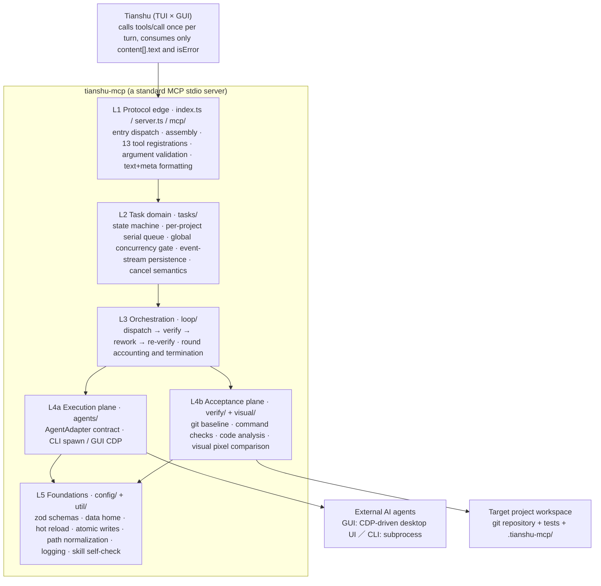
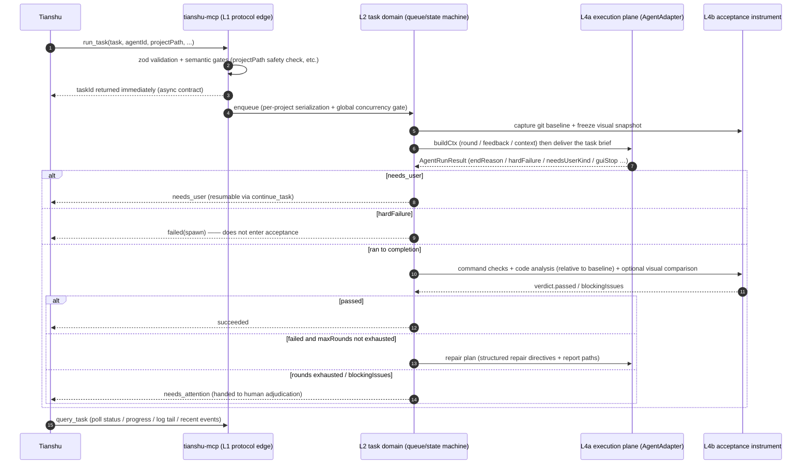

# tianshu-mcp — Core Principles

[中文](core-principles.md)

> Version baseline: `0.7.6` (as read from `package.json` / git HEAD `25e3641`)
> Method: static reading of source and architecture documents, **no tests or verification commands were run** (see "Verification status" at the end)
> Citation convention: `file:line` means the content at that line was checked with a tool during this session; a bare path means the file was read but no line was pinned.

---

## 1. The core in one sentence

**tianshu-mcp is an orchestration layer that splits "who does the work" from "how good work is measured" into two independently replaceable things, and forces "done" to be proven by runtime evidence.**

The question it answers: **the agent says "it's done" — who proves it actually is.**

So the weight of the architecture is not in "how to drive an agent" (that is only the execution plane); it is in "how to obtain objective evidence that decides whether the agent's output qualifies". This is why `README.md` lists the three responsibilities as peers:

```text
Tianshu (commander / interaction surface / adjudicator)
        ↓  MCP over stdio (stdout carries JSON-RPC only)
tianshu-mcp  =  scheduling  +  execution plane  +  objective acceptance instrument
        ↓
Codex · TraeWork · ZCode · Kimi Code · Qoder CN · Open Design
        ↓ (GUI driven over CDP on the desktop UI; CLI runs as a subprocess)
Target project workspace (git repository + tests + .tianshu-mcp/)
```

---

## 2. Four hard constraints: why the code looks the way it does

This is the key to the whole project. `README.md` and `ARCHITECTURE.md` §1.1 both stress the same sentence: **the shape of this project is not the result of free design — it was forced by four measured hard constraints.**

| # | Measured constraint | Architectural consequence | Code anchor |
|---|---|---|---|
| C1 | Tianshu's MCP tools **return text only** (`content[].text` is concatenated into a string, `isError` is passed through) | Every result is standardized as "human-readable text + a `---tianshu-mcp-meta---` JSON block" so the host can extract it with a regex; no reliance on resources / prompts | `src/mcp/formatter.ts:104-106` |
| C2 | Tianshu calls `tools/call` **once per turn, synchronously** | Long tasks must be asynchronous: `run_task` returns a `taskId` immediately and `wait_task` blocks until a stop point (`query_task` polls for progress); there is no server-side push | `src/mcp/tools.ts:58` (`run_task` definition), `src/mcp/tools.ts:109` (`wait_task`), `src/mcp/tools.ts:67` (`query_task`) |
| C3 | Desktop agents' requests are encrypted at the transport layer and cannot be constructed outside the client | The only viable path is to **drive the desktop UI over CDP and extract results from the DOM** | `src/agents/{codex,zcode,traework,kimicode,qoder,opendesign}/cdp.ts` |
| C4 | The Codex desktop app is an **MSIX store package**, so a GUI host cannot `CreateProcess` it directly | It must be activated through COM with an injected, dedicated `--user-data-dir` before a CDP port can be opened | `src/agents/codex/launcher.ts` |

C3 and C4 are two faces of the same problem: **whenever the UI environment can be driven, do not try to construct its network requests.**

---

## 3. Layered architecture

The dependency direction is **strictly downward**: `L1 → L2 → L3 → {L4a, L4b} → L5`.



**The single most important decoupling boundary: L4a and L4b do not depend on each other; they meet only in L3.**
That is, "who does the work" and "how good work is measured" are two independently replaceable things. It is also why a new agent can be added without touching the acceptance engine, and the acceptance policy can change without touching any agent.

The layering and module boundaries match `ARCHITECTURE.md` §2; the L1–L5 responsibilities in the table above correspond to that document item by item.

---

## 4. The core principles, one by one

### 4.1 The single execution-plane seam: `AgentAdapter`

`src/agents/adapter.ts:160-179`:

```ts
export interface AgentAdapter {
  id: string;
  buildInvocation(ctx: TaskContext, resolved: ResolvedAgent): SpawnInvocation;  // :163
  parseExit(res: {...}): AgentRunResult;                                        // :165
  run?(ctx, resolved, opts: AgentRunOptions): Promise<AgentRunResult>;          // :178
}
```

**This is the most important abstraction in the project**, because it funnels two completely different execution models into one interface:

- `run()` **absent** → the orchestrator goes through `runChild()` and spawns a subprocess (CLI agents). The `runChild` import at `src/loop/fix-loop.ts:20` is the other half of that path.
- `run()` **present** → the orchestrator does not spawn at all; it calls `run()`, and the adapter carries the entire CDP orchestration itself (GUI agents).

**Consequence: a new agent = one profile (data) + (if needed) one adapter file, with zero changes to the orchestration core.**

The landing point is `src/agents/registry.ts`: at construction time all seven ids — `codex / zcode / traework / kimicode / qoder / opendesign / stub` — get a `CliAdapter` base, and `resolve()` swaps in GUI implementations according to `profile.adapter`, rebuilding **only when the implementation class changes** (so a running task is never disrupted).

> Note: the explicit `profile.adapter` discriminant takes precedence over `driver` — `driver:"spawn"` combined with `adapter:"codex-gui"` still swaps in the GUI implementation.

### 4.2 The acceptance instrument: relative to a git baseline, fail-closed

This is what distinguishes the project from an ordinary "AI coding tool shell".

**The core principle is attribution**: before work starts, a git baseline is captured (HEAD + content hashes of already-tracked dirty files + the list of untracked files). At verification time, files that were **already dirty before work started and whose current hash still matches the baseline** are **excluded from this round's change set**. That way `changedFiles` in the report reflects the agent's real changes this round, not the repository's pre-existing dirtiness.

**Never stash / commit / roll back** — this is a hard red line, not an implementation detail.

Three fail-closed protections (all traced to concrete implementations in `src/verify/acceptance.ts`):

| Protection | Criterion | Code location |
|---|---|---|
| **Zero test cases** | Exit code 0 but output matches `# tests 0` / `no tests found` / `no tests ran` / `0 tests (ran\|executed\|found)` → flipped to failure | `:64-69` (`ZERO_TEST_CASE_PATTERNS`), `:71-72` (`detectZeroTestCases`) |
| **Zero changes** | A git project with no net change against the baseline → a failing `no-changes` check is appended; with `requireChanges: false` it is only noted, not enforced | `:186` (defaults to `true`), `:424-438` |
| **Cancelled means failed** | If the round is cancelled at any point → `passed=false`; checks that never started are recorded as `skipped` with the reason "task cancelled, not executed" | `:458`, `:574-577`, `:646-648` |

The second one explains why pure analysis / Q&A tasks **must explicitly** set `requireChanges: false` in `.tianshu-mcp/acceptance.json` — otherwise "no files were changed" is judged a failure.

### 4.3 The rework loop: failures must become "directly executable actions"

A failure is not the whole report thrown back at the agent; it is parsed into a structured directive of the form `{ file?, line?, issue, action, source }` (`src/verify/directives.ts`).

**A design trade-off worth recording** (`ARCHITECTURE.md` §7.3): **test-class output is deliberately not extracted.** The reason is that test-framework output has no stable file/line information, and forcing a parse produces **incorrect locations** — worse than providing nothing. Such cases therefore always take an explicit fallback:

- A non-empty `fallbackReason` ⇒ the renderer must state that the directives are "unavailable" and require the agent to go back to the full failure output; **silently leaving it blank is not allowed**.
- Extraction happens only on failing rounds (a passing round has nothing to fix).
- It never throws: an exception from a single source is swallowed and recorded in `fallbackReason`, while the other sources keep working.

Feedback reaches the agent through two paths dispatched per agent: Codex gets `<project>/.zcode/plans/codex-fix-r<N>.md`, everyone else (including CLI) gets `rework-<taskId>-r<round>.md` in the task directory.

### 4.4 Scheduling and the state machine

**Ten states** (`src/tasks/task.ts`):

```text
queued · running · verify_start · fixing · succeeded · failed
needs_attention · needs_user · cancelled · interrupted
```

- **Terminal**: `succeeded, failed, needs_attention, cancelled, interrupted`
- **Active**: `queued, running, verify_start, fixing`
- **`needs_user` is neither active nor terminal** — it is the host-visible form of a GUI agent waiting for human intervention, and it can only be moved back to `queued` by `continue_task`. This single point is the key to reading GUI orchestration semantics.
- The `TRANSITIONS` table enumerates the legal transitions explicitly, and `TaskStore.updateStatus` adds a further guard: "a terminal state can only be re-entered by an explicit continue / rework".

**Concurrency model = per-project serialization + a global concurrency gate** (`src/tasks/task-manager.ts`):

| Mechanism | Implementation |
|---|---|
| Global concurrency gate | `concurrency.maxRunning` (default 2) |
| Per-project serialization | `queueKeyOf()` (`:90-92`) buckets by normalized `projectPath`; project-less tasks use the constant key `__zcode_default_workspace__` (`:89`) |
| Why `undefined` / empty string is not acceptable | Otherwise project-less tasks would be merged into the same queue as "empty path", and `projectBusy()`'s equality test would lose its meaning (verbatim from the comment at `:85-88`) |
| Scheduling pump | `pump()` (`:617`): while capacity remains, start one task for each project whose head is runnable; `projectBusy()` (`:608`) prevents a second concurrent task in the same project |
| Task timeout backstop | Beyond the orchestration-layer timeout, `startTask` adds a `taskTimeoutMs + 15s` safety timer to catch the orchestration layer itself hanging |

**Dual-write persistence**: `task.jsonl` (the append-only event stream, the single authoritative timeline) + `task.json` (an atomically written snapshot for fast reads and crash rebuilds).

**The post-crash recovery policy is "archive, do not resume"**: `initialize()` scans for leftover active tasks and marks every one of them `interrupted`. The reason: GUI sessions and subprocesses are already orphaned once the server exits, so a silent resume would produce half-finished work that cannot be attributed. Recovery must be triggered by an explicit human `rework_task`.

### 4.5 Two hard boundaries (the soul of the architecture)

> **The agent's "done" is not an acceptance verdict** (only `verdict.passed` counts);
> **environment / auth errors do not enter acceptance or rework** (`hardFailure` fails terminally at once).

The second has a direct implementation at `src/loop/fix-loop.ts:285-291` (`runRes.hardFailure` → `finish("failed","spawn", ...)`). The reasoning: treating an infrastructure/auth problem as a code problem burns rework rounds for nothing and produces meaningless "fixes".

Another expression of the same idea is `pendingVisualVerification`: a task blocked by a missing approved baseline or a modified baseline **re-verifies first** when resumed via `rework_task`, and finishes immediately if it passes — avoiding a wasted agent round caused by "a policy problem mistaken for a code problem".

---

## 5. The complete fact flow of a single task



---

## 6. The MCP tool surface (13 tools)

Each verified in `src/mcp/tools.ts` (the line number is where `name:` sits):

| Line | Tool | Capability family | Requires approval | Purpose |
|---|---|---|---|---|
| 35 | `prepare_visual_baseline` | write | yes | Produce baseline candidates and a digest; does not adopt a formal baseline |
| 42 | `approve_visual_baseline` | write | yes | After user review, verify the digest and write the baseline |
| 50 | `continue_task` | write | yes | Resume the original session of a `needs_user` task |
| 58 | `run_task` | write | yes | Dispatch work; returns `taskId` asynchronously |
| 67 | `query_task` | read | no | Poll status / progress / log tail / recent events |
| 79 | `list_tasks` | read | no | Historical task list |
| 86 | `get_task_report` | read | no | Fetch the full `report.md` of a round |
| 93 | `cancel_task` | write | yes | Cancel; for a terminal GUI task it also serves as the manual-confirmation entry point |
| 101 | `verify_task` | **execute** | no | Run acceptance once standalone (runs project commands but does not modify source) |
| 109 | `wait_task` | read | no | Block until one task reaches a stop point (terminal status or `needs_user`) or the timeout elapses; read-only, harmless |
| 117 | `wait_any` | read | no | Block until the first of a group reaches a stop point, in array order; returns its snapshot plus every task's status |
| 125 | `rework_task` | write | yes | Manual rework: feed the failure summary back to the same agent |
| 136 | `get_profiles` | read | no | Agent adapters and executable discovery results |

**The three capability families (R11)**: `read` has no side effects; `write` has side effects and always requires approval; `execute` runs project-side commands but does not modify source — currently only `verify_task`.

**`readOnlyHint` and approval are two different things** (the registration loop in `src/server.ts`): `readOnlyHint` is derived from `capability === "read"`, so `verify_task` carries `false` for that annotation; but **whether approval is required is carried separately by `_meta.requireApproval`**, and for `verify_task` that field is always `false`. "It runs commands" does not mean "it needs approval".

**Return contract**: human-readable body + trailing meta block, and the meta block is the only machine-readable channel.

```text
<human-readable text>
---tianshu-mcp-meta---
{ ...taskId, status, ok, round, changedFiles, diffstat, ... }
---tianshu-mcp-meta---
```

**Progress is persisted, not pushed**: a GUI adapter reports progress every `gui.progressIntervalMs` (default 30s), which is written as a `note` event in `task.jsonl`; `query_task` reads the latest snapshot and event stream each time, so a poller always sees "the last fact written to disk".

---

## 7. How the six GUI drivers differ (measured conclusions)

Each of the six adapters is a complete CDP flow of "discover → launch/reuse instance → bind project → select model → send → decide completion". Their **shared principle** is the completion decision:

```text
A running signal is present (stop button / loading / active tool call)  → still running, never end
  ↓ running signal disappears
A DOM completion marker appears                                          → declare complete
  ↓ no completion marker
Text hash unchanged for N consecutive rounds + input box usable again     → declare complete (stableRounds)
  ↓ no running signal ever observed
Idle time reaches idleTimeoutMs (default 10 minutes)                      → idle_timeout (abnormal end, instance kept)
```

**The running signal takes absolute precedence over the completion marker** — this was learned the hard way: an early version treated "static for about 36 seconds" as completion, so long reasoning turns were declared complete prematurely.

The **specific constraints** of each driver:

| Agent | Specific constraint |
|---|---|
| **TraeWork** | Work / Code / Design **each keep their own project binding**, and switching mode replaces the composer's project with the one that mode last used → you must **switch mode first, then bind inside the target mode**, and after binding re-check that both "mode" and "project" are in place |
| **ZCode** | 3.14.x removed two DOM contracts, `data-project-path` and `data-testid^="workspace-item-"`, so the project's absolute path is no longer obtainable from the DOM → `boundProjectVerdict()` layers by evidence strength: strict equality when a path is available; when no path channel exists, match by display name and require the project list to contain no duplicate name (a duplicate yields `project_ambiguous` — **never guess**). The display name is never written into `projectPath` |
| **Codex** | MSIX COM activation + a dedicated `user-data-dir` |
| **Kimi Code** | **Dual renderer processes**: the model menu / reasoning level / execution mode menus are rendered by the in-app `browserOverlayOpenMenu()` into a separate `Kimi Browser Overlay` process → the CDP client is dual-page (main + overlay), and "is the menu open" must be decided from the overlay's `visibilityState`. **Project-less dispatch is not supported** |
| **Qoder CN** | Completion must be **bound to this round's user message** (a "done" in historical replies, a static UI, or a dropped connection all do not count); a checkpoint `qoder-session.json` is written before sending and before submitting an answer, and **while the receipt is unconfirmed it only observes and never auto-resends** |
| **Open Design** | **The only driver with a "product signal"**: while generating a design it can go a long time without updating the conversation yet keep writing files, so looking only at conversation text would judge normal work as "idle completion" → the quiescence criterion requires **both text and artifacts to be stable** |

---

## 8. The visual acceptance pipeline (optional module)

When disabled it has zero effect on existing behavior; when enabled it is an acceptance pipeline **independent of the command checks**.

```text
Set visual.enabled=true in the project's .tianshu-mcp/acceptance.json
  → run_task / verify_task append visual checks after the command checks (no new tools needed)
  → before work starts, freeze "visual config digest + baseline digest" and compare around every round (a change blocks with VISUAL_INTEGRITY)
  → page screenshots + pixel comparison (pixelmatch) / image specification checks / optional content verdicts
  → defects are reworked per autoFixRounds; blocking issues → needs_attention
  → rework_task re-verifies a blocked task first, before starting any agent
```

**One easily misread point**: snapshot freezing and comparison are **not controlled by `visual.enabled`** and always run. So "visual is not enabled" does not mean "no visual-related action happens at all" — it means "no visual comparison is performed, but the digests are still frozen and compared". That is how a change to the acceptance config or the baseline files themselves gets detected.

**A baseline must go through two phases**: `prepare_visual_baseline` only produces candidates and a digest, while `approve_visual_baseline` writes it only after explicit user review and authorization. **A missing baseline can never yield a pass, and automatic rework is forbidden from calling the approval entry point.**

**Credential boundary**: the MCP never reads, stores, or forwards any key, and bundles no model client; content verdicts are entirely delegated to a local command you supply. The egress gate is enforced at the **contract layer** only (`allowRemote` defaults to `false`, and a rule that is not opted in and uses `<image:base64:file>` is rejected outright by the schema) — **whether the command itself sends images out cannot be blocked at the system layer**, so you must confirm that yourself.

---

## 9. Configuration system and hot reload

| Configuration | Location | Key fields |
|---|---|---|
| Server configuration | `<data home>/config.json` | `concurrency.maxRunning` (2), `defaultTaskTimeoutMs` (30min), `verifyCommandTimeoutMs` (5min), `verifyConcurrency` (2, 1..4), `shutdown.guiStopWaitMs` (15s), `idempotency.*`, `skills.*` |
| Project registry | `<data home>/projects.json` | includes each project's `verify[]` |
| Agent profiles | `<data home>/agent-profiles.json` | **whole-key override** of the built-in profile |
| Project acceptance | `<project>/.tianshu-mcp/acceptance.json` | `checks[]`, `visual`, `requireChanges` (true), `verifyConcurrency` |

The data home defaults to `~/.tianshu-mcp` and can be overridden with `TIANSHU_MCP_HOME`.

**Two design disciplines**:

1. **Hot reload keys off a sha256 content fingerprint, not mtime** — so a change made within the same timestamp is still detected.
2. **Last-known-good policy** — on a JSON parse failure or a zod validation failure, **the previous valid configuration is retained** instead of being cleared; only a failure on the very first load falls back to schema defaults. This guarantees that "a broken config never deprives a running service of its configuration".

**Three-level acceptance configuration inheritance** (low → high priority): `<data home>/acceptance.default.json` → `<project>/.tianshu-mcp/acceptance.json` → the `acceptanceOverride` argument (a task-level temporary override, not persisted).

There is a **trap that must be remembered** here (verbatim from the comment at `src/config/schema.ts:86-92`): layered parsing must **never** use a schema that carries defaults. Parsing a project file that "only sets `verifyConcurrency`" with a schema that has `.default(true)` would materialize `requireChanges: true` and thereby **override the global layer's `false`**. Hence the separate `PartialAcceptanceConfigSchema` (every field optional, no defaults), with defaults supplied by consumers only where the final effective value is missing.

---

## 10. Security boundaries and hard red lines

Violating any one of these causes runtime damage or an incident:

1. **Never blindly kill a TraeWork process tree** — only terminate a PID that this module created and whose command line passes verification, and never with `/T`. (Historical incident: during validation, `taskkill /PID <pid> /T /F` killed an instance the user was actively using.)
2. **Reuse the user's instance by default** — never start a second one; managed instances also never touch an instance the user opened manually.
3. **computer-use allowlist** — only TraeWork's folder-selection dialog is permitted (dual verification of window title + host process); every other window is refused.
4. **Zero credential management** — never read, decrypt, or forward any agent credential; GUI adapters only drive the UI.
5. **Commands are never shell-concatenated** — acceptance commands are structured argv with `shell:false`.
6. **No automatic commit / stash / rollback** — a git baseline is captured before work starts and reports are computed relative to it.
7. **No hardcoded paths** — machine paths / usernames / ports go through profiles or placeholders.
8. **stdout carries JSON-RPC only** — all diagnostic logging goes to stderr (and is appended to the same-origin `logs/server.log`). Any noise written to stdout breaks the MCP stream and causes strict clients to fail the handshake.
9. **Skill content comes only from the package itself** — a skill to be installed is located relative to the package via `import.meta.url`, and **content is never discovered from `process.cwd()`**; a target directory whose content cannot be proven unmodified is never silently overwritten.

**Path safety gate**: `projectPath` is validated on submission — it must be absolute, the directory must exist, and symlinks are normalized via realpath; **the home directory itself and system/root-level directories are refused outright**, so a worker's write permission can never cover an entire system subtree.

> Known residual boundary (`ARCHITECTURE.md` §15, item 12): `/etc`, `/usr`, `/bin`, `/sbin`, `/private/etc`, `c:/windows` and `c:/program files*` are already refused as subtrees, but `/var`, `/tmp`, `/opt`, `/library`, `/system`, `/root`, `c:/users` only block an **exact match of the root**, so their subdirectories can still be used as workspaces. This is a deliberate trade-off — on macOS `os.tmpdir()` is `/var/folders/...`, and a blanket rule would sever the test harness and a large number of legitimate workspaces.

---

## 11. Scale and delivery discipline (measured this session)

| Item | Value | How it was obtained |
|---|---|---|
| `src/**/*.ts` | 150 files / 38,339 lines | `find src -name "*.ts"` + `wc -l` |
| `test/**/*.ts` | 123 files / 29,190 lines | `find test -name "*.ts"` + `wc -l` (note: README states "115 test files", which is vitest's collected count; the two are different yardsticks, not a contradiction) |
| GUI adapters | 6 | `ls src/agents/*/adapter.ts` |
| Commit count | 418 | `git rev-list --count HEAD` |
| Version | 0.7.6 | `package.json` |
| Runtime dependencies | 6 (MCP SDK / puppeteer-core / @puppeteer/browsers / pixelmatch / cross-spawn / zod) | `package.json` |

Test code is about **76%** of source code. This is not an incidental by-product — CI covers a Windows / macOS / Linux × Node 20/22/24 matrix, and the whole "objective acceptance" promise only holds because the test density itself is credible.

---

## 12. Why the principles are self-consistent

All four modules are corollaries of the same constraints, not a pile of design preferences:

- Because the host **can only call synchronously and receive text** (C1 / C2) → tasks must be asynchronous, and results must carry a machine-readable meta block.
- Because desktop agents **cannot have their requests constructed externally** (C3 / C4) → the execution plane can only drive the UI, and it must tolerate selector drift.
- Because the execution plane is **unreliable** and the agent's **self-report is not trustworthy** → there must be an acceptance instrument independent of the execution plane, and acceptance must be relative to the pre-work baseline, fail-closed, and reworkable.
- Because rework **consumes real quota and rounds** → "code failure" and "environment failure" must be strictly separated, with the latter failing terminally and never entering rework.

---

## 13. Verification status and sources of fact

**This must be stated plainly**: this document is the product of **static reading**, and **no tests or verification commands were run**, therefore:

- Every "the implementation does X" assertion comes from `read_file` / `grep` output on the corresponding file during this session;
- Line numbers cited in this document come from this session's tool output and have **not been re-verified at runtime**; a bare path means the file was read but no line was pinned;
- "Architectural intent" and "why it is designed this way" conclusions come from `ARCHITECTURE.md` (1119 lines) and `README.md`; where they were cross-checked against source, the code anchor is noted inline;
- The per-driver differences in §7, the visual pipeline in §8, and the historical incident notes in §10 are all quoted from the project's own documentation and were **not independently reproduced this session**.

Files actually read or searched during this session:

```text
package.json
README.md
ARCHITECTURE.md
AGENTS.md (partial, head)
src/index.ts
src/server.ts
src/agents/adapter.ts
src/agents/registry.ts
src/mcp/formatter.ts
src/mcp/tools.ts
src/tasks/task.ts
src/tasks/task-manager.ts
src/loop/fix-loop.ts (partial ranges)
src/verify/acceptance.ts (partial ranges)
```

The three smallest commands that would verify the claims here:

```bash
npm run typecheck          # type gate (tsc --noEmit)
npm test                   # test suite (README states 1383 passed / 12 skipped)
npm run check:stdio        # verifies stdout carries JSON-RPC only (the automated check for red line 8)
```

> Note: this repository provides no `--help`-style argument dispatch — `src/index.ts` recognizes only the two subcommands `visual` and `config`; any other argument falls through to stdio server mode.
