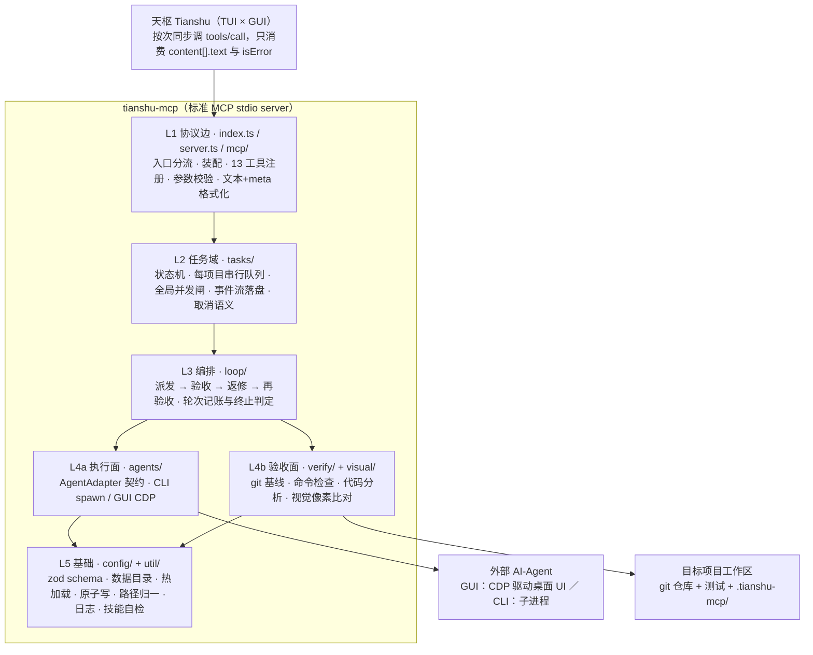
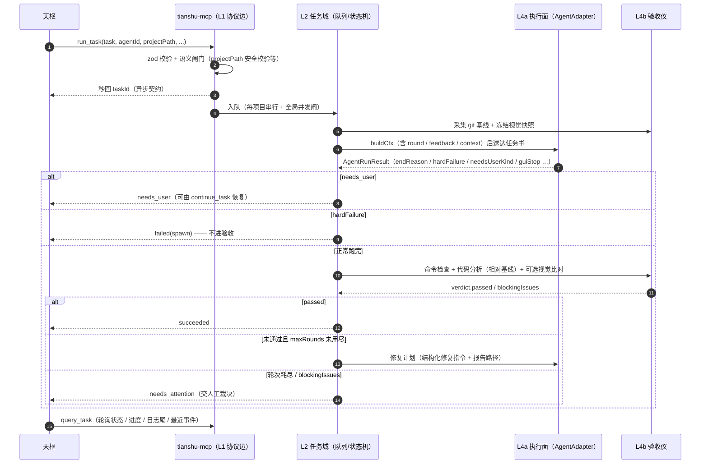

# tianshu-mcp 核心原理分析

[English](core-principles.en.md)

> 版本基线：`0.7.6`（读取时 `package.json` / git HEAD `25e3641`）
> 分析方法：静态阅读源码与架构文档，**未运行测试与验证命令**（见文末「验证状态」）
> 引用体例：`文件路径:行号` 表示本次阅读时该行内容确经工具核对；仅有路径者表示已读该文件但未固定行号

---

## 1. 一句话核心

**tianshu-mcp 是一个把「派活」与「验收」拆成两件独立可替换的事、并强制「完成」必须由运行时证据证明的编排层。**

它回答的问题是：**Agent 说「做完了」，谁来证明真的做完了。**

因此整套架构的重心不在「怎么驱动 agent」——那只是执行面；重心在「怎么拿到客观证据判定它是否合格」。这也是 `README.md` 把三个职责并列的根本原因：

```text
天枢 Tianshu（总指挥 / 交互面 / 裁决）
        ↓  MCP over stdio（stdout 仅承载 JSON-RPC）
tianshu-mcp  =  调度  +  执行面  +  客观验收仪
        ↓
Codex · TraeWork · ZCode · Kimi Code · Qoder CN · Open Design
        ↓（GUI 经 CDP 驱动桌面 UI；CLI 走子进程）
目标项目工作区（git 仓库 + 测试 + .tianshu-mcp/）
```

---

## 2. 四条硬约束：为什么代码长成这样

这是理解全项目的钥匙。`README.md` 与 `ARCHITECTURE.md` §1.1 都强调同一句话：**本项目的形态不是自由设计的结果，而是四条实测硬约束逼出来的。**

| # | 实测约束 | 架构后果 | 代码落点 |
|---|---|---|---|
| C1 | 天枢的 MCP 工具**只回文本**（`content[].text` 被拼成字符串，`isError` 透传） | 所有结果统一为「人类可读文本 + `---tianshu-mcp-meta---` JSON 块」，便于宿主正则抽取；不依赖 resources / prompts | `src/mcp/formatter.ts:104-106` |
| C2 | 天枢**按次同步**调用 `tools/call` | 长任务必须异步化：`run_task` 秒回 `taskId`，`wait_task` 阻塞等到停点（`query_task` 轮询看进度）；无服务端推送 | `src/mcp/tools.ts:58`（`run_task` 定义）、`src/mcp/tools.ts:109`（`wait_task`）、`src/mcp/tools.ts:67`（`query_task`） |
| C3 | 桌面 agent 的请求在传输层加密，无法在客户端外构造 | 唯一可行路径是 **CDP 驱动桌面 UI，从 DOM 提取结果** | `src/agents/{codex,zcode,traework,kimicode,qoder,opendesign}/cdp.ts` |
| C4 | Codex 桌面端是 **MSIX 商店包**，GUI 宿主无法直接 `CreateProcess` | 必须经 COM 激活并注入专属 `--user-data-dir` 才能开 CDP 端口 | `src/agents/codex/launcher.ts` |

C3 与 C4 是同一类问题的两种表现：**只要能驱动 UI 环境，就不去构造它的网络请求。**

---

## 3. 分层架构

依赖方向**严格单向向下**：`L1 → L2 → L3 → {L4a, L4b} → L5`。



**最关键的一条解耦边界：L4a 与 L4b 互不依赖，只在 L3 汇合。**
即「谁来干活」与「怎么算干得好」是两件独立可替换的事。这也是为什么能新增一个 agent 而不碰验收引擎、能改验收策略而不碰 agent。

分层图与模块边界与 `ARCHITECTURE.md` §2 一致；上表 L1–L5 的职责描述在该文档中逐条对应。

---

## 4. 核心原理逐条拆解

### 4.1 唯一的执行面接缝：`AgentAdapter`

`src/agents/adapter.ts:160-179`：

```ts
export interface AgentAdapter {
  id: string;
  buildInvocation(ctx: TaskContext, resolved: ResolvedAgent): SpawnInvocation;  // :163
  parseExit(res: {...}): AgentRunResult;                                        // :165
  run?(ctx, resolved, opts: AgentRunOptions): Promise<AgentRunResult>;          // :178
}
```

**这是整个项目最重要的抽象**，因为它把两种完全不同的执行方式收敛到同一个接口：

- `run()` **不存在** → 编排器走 `runChild()` spawn 子进程（CLI 类 agent）。`src/loop/fix-loop.ts:20` 导入 `runChild` 即该路径的另一半。
- `run()` **存在** → 编排器不再 spawn，直接调用它，由 adapter 自己承担全部 CDP 编排（GUI 类 agent）。

**后果：新 agent = 一个 profile（数据）+（如需）一个 adapter 文件，零改编排核心。**

落地点在 `src/agents/registry.ts`：构造时先给 `codex / zcode / traework / kimicode / qoder / opendesign / stub` 七个 id 全部装上 `CliAdapter` 基座，`resolve()` 时按 `profile.adapter` 换装 GUI 实现，且**仅在实现类变化时重建**（不打断正在运行的任务）。

> 注意：`profile.adapter` 的显式判别优先于 `driver` —— `driver:"spawn"` 配 `adapter:"codex-gui"` 仍会换装 GUI 实现。

### 4.2 验收仪：相对 git 基线 + fail-closed

这是本项目区别于普通「AI 编码工具壳」的地方。

**核心原理是归因**：动工前采集 git 基线（HEAD + 已跟踪脏文件的内容哈希 + 未跟踪文件清单），验收时把「动工前就已脏、且当前哈希与基线一致」的文件**排除在本轮变更之外**。这样报告里的 `changedFiles` 反映的是本轮 agent 的真实改动，而不是仓库原有的脏状态。

**绝不 stash / commit / 回滚**——这是硬红线，不是实现细节。

三条 fail-closed 保护（均在 `src/verify/acceptance.ts` 中核到具体实现）：

| 保护 | 判据 | 代码位置 |
|---|---|---|
| **零用例** | 退出码 0 但输出命中 `# tests 0` / `no tests found` / `no tests ran` / `0 tests (ran\|executed\|found)` → 翻转为失败 | `:64-69`（`ZERO_TEST_CASE_PATTERNS`）、`:71-72`（`detectZeroTestCases`） |
| **零变更** | git 项目相对基线无净变更 → 追加一条失败的 `no-changes` 检查项；`requireChanges: false` 时只记 note 不拦截 | `:186`（默认 `true`）、`:424-438` |
| **取消即失败** | 本轮任一时刻被取消 → `passed=false`；未启动的检查记 `skipped`，理由「任务取消，未执行」 | `:458`、`:574-577`、`:646-648` |

第二条解释了为什么纯分析/问答类任务**必须显式**在 `.tianshu-mcp/acceptance.json` 里设 `requireChanges: false`——否则「没改文件」会被判失败。

### 4.3 返修闭环：失败要变成「可直接执行的动作」

失败不是把整篇报告甩回给 agent，而是解析成 `{ file?, line?, issue, action, source }` 的结构化指令（`src/verify/directives.ts`）。

**一个值得记录的设计取舍**（`ARCHITECTURE.md` §7.3）：**刻意不为 test 类输出做提取**。理由是测试框架输出没有稳定的文件/行号，强行解析会产出**错误定位**——比不给更糟。因此这类一律走显式回退：

- `fallbackReason` 非空 ⇒ 渲染方必须写明「不可用」并要求 agent 回到完整失败输出，**不允许静默留空**。
- 只在失败轮次提取（通过的轮次没有要修的东西）。
- 绝不抛错：单个 source 异常被吞掉并记入 `fallbackReason`，其余 source 继续工作。

反馈回到 agent 有两条按 agent 分派的路径：Codex 走 `<项目>/.zcode/plans/codex-fix-r<N>.md`，其余（含 CLI）走任务目录下的 `rework-<taskId>-r<round>.md`。

### 4.4 调度与状态机

**状态集 10 个**（`src/tasks/task.ts`）：

```text
queued · running · verify_start · fixing · succeeded · failed
needs_attention · needs_user · cancelled · interrupted
```

- **终态**：`succeeded, failed, needs_attention, cancelled, interrupted`
- **活动态**：`queued, running, verify_start, fixing`
- **`needs_user` 既非活动态也非终态** —— 它是 GUI agent 等人工介入时的宿主可见形态，只能被 `continue_task` 恢复到 `queued`。这一条是理解 GUI 编排语义的关键。
- 迁移表 `TRANSITIONS` 显式枚举合法迁移，`TaskStore.updateStatus` 额外守卫「终态只能由显式 continue / rework 重新进入」。

**并发模型 = 每项目串行 + 全局并发闸**（`src/tasks/task-manager.ts`）：

| 机制 | 实现 |
|---|---|
| 全局并发闸 | `concurrency.maxRunning`（默认 2） |
| 每项目串行 | `queueKeyOf()`（`:90-92`）按规范化 `projectPath` 分桶；无项目任务用常量键 `__zcode_default_workspace__`（`:89`） |
| 为什么不能用 `undefined` / 空串 | 否则无项目任务会与「空路径」混成一队，且 `projectBusy()` 的判等失去意义（`:85-88` 注释原话） |
| 调度泵 | `pump()`（`:617`）：只要名额未满，就为每个「队首可用」的项目启动一个任务；`projectBusy()`（`:608`）阻止同项目第二个任务并发 |
| 任务超时护栏 | 编排层超时之外，`startTask` 另加 `taskTimeoutMs + 15s` 兜底计时器，防编排层自身挂死 |

**双写持久化**：`task.jsonl`（追加式事件流，唯一权威时间线）+ `task.json`（原子写快照，供快速读取与崩溃重建）。

**崩后恢复策略是「归档而非续跑」**：`initialize()` 扫描遗留的活动态任务，一律标 `interrupted`。理由：GUI 会话与子进程已随 server 退出而失联，静默续跑会产生无法归因的半成品；恢复必须由人显式 `rework_task` 触发。

### 4.5 两条硬边界（架构的灵魂）

> **agent 的「完成」不是验收结论**（只有 `verdict.passed` 才算）；
> **环境 / 认证类错误不进验收与返修**（`hardFailure` 直接终态失败）。

第二条在 `src/loop/fix-loop.ts:285-291` 有直接实现（`runRes.hardFailure` → `finish("failed","spawn", ...)`）。理由是：把基础设施/认证问题当成代码问题，会白烧返修轮次、产出无意义的「修复」。

同一思路的另一处体现是 `pendingVisualVerification`：因缺少已批准基准或基准被改动而阻塞的任务，在 `rework_task` 恢复时**先重新验收**，通过即结束——避免「规则问题被当成代码问题」白烧一轮 agent。

---

## 5. 单任务完整事实流



---

## 6. MCP 工具面（13 个）

`src/mcp/tools.ts` 中逐个核对（行号即 `name:` 所在行）：

| 行 | 工具 | 能力族 | 需审批 | 作用 |
|---|---|---|---|---|
| 35 | `prepare_visual_baseline` | write | 是 | 生成基准候选与摘要，不落正式基准 |
| 42 | `approve_visual_baseline` | write | 是 | 用户审阅后核对摘要并写入基准 |
| 50 | `continue_task` | write | 是 | 恢复 `needs_user` 的原会话 |
| 58 | `run_task` | write | 是 | 派活，异步返回 `taskId` |
| 67 | `query_task` | read | 否 | 轮询状态 / 进度 / 日志尾 / 最近事件 |
| 79 | `list_tasks` | read | 否 | 历史任务列表 |
| 86 | `get_task_report` | read | 否 | 取某轮 `report.md` 全文 |
| 93 | `cancel_task` | write | 是 | 取消；对终态 GUI 任务兼任人工确认入口 |
| 101 | `verify_task` | **execute** | 否 | 独立跑一次验收（会跑项目命令，但不改源码） |
| 109 | `wait_task` | read | 否 | 阻塞等待单任务到停点（终态或 `needs_user`）或超时；纯只读、无害 |
| 117 | `wait_any` | read | 否 | 阻塞等待一组任务中数组顺序首个到停点者，返回其快照 + 全部状态 |
| 125 | `rework_task` | write | 是 | 手动返修，把失败摘要喂回同一 agent |
| 136 | `get_profiles` | read | 否 | agent 适配与可执行探测结果 |

**三族语义（R11）**：`read` 无副作用；`write` 有副作用、全部需审批；`execute` 会执行项目侧命令但不改源码——当前仅 `verify_task`。

**`readOnlyHint` 与审批是两件事**（`src/server.ts` 注册循环）：`readOnlyHint` 按 `capability === "read"` 推导，因此 `verify_task` 该注解为 `false`；但**审批与否由 `_meta.requireApproval` 单独承载**，`verify_task` 该字段恒为 `false`。「会跑命令」不等于「需要审批」。

**返回契约**：人类可读正文 + 尾随元块，元块为唯一机读通道。

```text
<人类可读文本>
---tianshu-mcp-meta---
{ ...taskId, status, ok, round, changedFiles, diffstat, ... }
---tianshu-mcp-meta---
```

**进度只落盘、不推送**：GUI adapter 按 `gui.progressIntervalMs`（默认 30s）回报进度，写成 `task.jsonl` 的 `note` 事件；`query_task` 每次读最新快照与事件流，因此轮询者看到的是「最后一次落盘的事实」。

---

## 7. 六个 GUI driver 的差异（实测结论）

六个 adapter 各自是一整套「发现 → 启动/复用实例 → 绑项目 → 选模型 → 发送 → 判定完成」的 CDP 流程。它们的**共同原则**是完成判定：

```text
运行信号存在（停止按钮 / loading / 活跃工具调用）  → 仍在运行，一律不结束
  ↓ 运行信号消失
DOM 完成标志出现                                  → 判定完成
  ↓ 无完成标志
文本哈希连续 N 轮不变 + 输入框重新可用            → 判定完成（stableRounds）
  ↓ 始终未观测到运行信号
空闲计时达 idleTimeoutMs（默认 10 分钟）           → idle_timeout（异常结束，保留实例）
```

**运行信号绝对优先于完成标志**——这是踩出来的：早期版本把「静态约 36 秒」当完成，导致长思考被提前判完成。

各 driver 的**特有约束**：

| agent | 特有约束 |
|---|---|
| **TraeWork** | Work / Code / Design **各自维护独立的项目绑定**，切模式会把输入栏项目换成该模式上次使用的项目 → 必须**先切模式、再在目标模式里绑定**，绑定后复核「模式 + 项目」双双就位 |
| **ZCode** | 3.14.x 删除了 `data-project-path` 与 `data-testid^="workspace-item-"` 两处 DOM 契约，项目绝对路径在 DOM 上不再可得 → `boundProjectVerdict()` 按证据强度分层：路径可得时严格判等；无路径渠道时按显示名且要求列表无同名项（同名即 `project_ambiguous`，**绝不猜测**）。显示名不写进 `projectPath` |
| **Codex** | MSIX COM 激活 + 专属 `user-data-dir` |
| **Kimi Code** | **双渲染进程**：模型菜单 / 思考档位 / 执行模式菜单由应用内 `browserOverlayOpenMenu()` 渲染在独立的 `Kimi Browser Overlay` 进程 → CDP 客户端是双页面（main + overlay），判定「菜单是否打开」必须以 overlay 的 `visibilityState` 为准。**不支持无项目派发** |
| **Qoder CN** | 完成判定**必须绑定本轮用户消息**（历史回复里的「完成」、界面静止、连接断开都不算）；发送与答题提交前先写检查点 `qoder-session.json`，**未确认回执时只观察、绝不自动重发** |
| **Open Design** | **唯一带「产物信号」的 driver**：生成设计稿时会长时间不刷对话却持续写文件，只看对话文本会把正常工作判成「空闲完成」→ 静止判据要求**文本与产物双稳定** |

---

## 8. 视觉验收链路（可选模块）

未启用时对既有行为零影响；启用后是一条**独立于命令检查**的验收链路。

```text
项目 .tianshu-mcp/acceptance.json 配 visual.enabled=true
  → run_task / verify_task 在命令检查之后追加视觉检查（不需要新工具）
  → 动工前冻结「视觉配置摘要 + 基准摘要」，每轮前后核对（变动即 VISUAL_INTEGRITY 阻塞）
  → 页面截图 + 像素比对（pixelmatch）/ 图片规格校验 / 可选内容判定
  → 缺陷按 autoFixRounds 返修；阻塞 → needs_attention
  → rework_task 对阻塞任务先重新验收，不先启动 agent
```

**一个容易误读的点**：快照冻结与核对**不受 `visual.enabled` 控制**，恒定执行。因此「视觉未启用」不等于「完全没有视觉相关动作」——而是「不做视觉比对，但仍会冻结并核对摘要」。这样改验收配置或基准文件本身也会被检出。

**基准必须两阶段**：`prepare_visual_baseline` 只生成候选与摘要，`approve_visual_baseline` 仅在用户明确审阅并授权后写入。**缺基准不得判通过，自动返修禁止调用批准入口。**

**凭证边界**：MCP 不读取、不存储、不转发任何密钥，也不内置模型客户端；内容判定完全委托用户自备的本地命令。外发闸门只在**契约层**强制（`allowRemote` 默认 `false`，未放行的规则使用 `<image:base64:file>` 会被 schema 直接拒绝）——**命令自身是否外传图片无法在系统层拦截**，须用户自行确认。

---

## 9. 配置系统与热加载

| 配置 | 位置 | 关键字段 |
|---|---|---|
| server 配置 | `<数据目录>/config.json` | `concurrency.maxRunning`(2)、`defaultTaskTimeoutMs`(30min)、`verifyCommandTimeoutMs`(5min)、`verifyConcurrency`(2, 1..4)、`shutdown.guiStopWaitMs`(15s)、`idempotency.*`、`skills.*` |
| 项目登记 | `<数据目录>/projects.json` | 含每项目 `verify[]` |
| agent profile | `<数据目录>/agent-profiles.json` | 按 key **整键覆盖**内置 profile |
| 项目验收 | `<项目>/.tianshu-mcp/acceptance.json` | `checks[]`、`visual`、`requireChanges`(true)、`verifyConcurrency` |

数据目录默认 `~/.tianshu-mcp`，可用 `TIANSHU_MCP_HOME` 覆盖。

**两条设计纪律**：

1. **热加载靠 sha256 内容指纹，不靠 mtime** —— 因此同一时间戳内的修改也能被感知。
2. **last-known-good 策略** —— JSON 解析失败或 zod 校验失败时**保留上一份有效配置**而不是清空；首次加载就失败才回落到 schema 默认值。这保证「配置写坏不会让正在运行的服务失去配置」。

**验收配置三级继承**（优先级低 → 高）：`<数据目录>/acceptance.default.json` → `<项目>/.tianshu-mcp/acceptance.json` → `acceptanceOverride` 参数（任务级临时覆盖，不落盘）。

这里有一个**必须记住的隐患**（`src/config/schema.ts:86-92` 注释原话）：分层解析**绝不能**用带默认值的 schema。若用带 `.default(true)` 的 schema 去解析「只写了 `verifyConcurrency`」的项目文件，会 materialize 出 `requireChanges: true`，**反过来把全局层的 `false` 覆盖掉**。因此存在独立的 `PartialAcceptanceConfigSchema`（所有字段可选、无默认值），默认值只在最终生效值缺省时由消费方兜底。

---

## 10. 安全边界与硬性红线

违反任一条即造成运行时损坏或事故：

1. **绝不按进程树盲杀 TraeWork** —— 只终止本模块创建、且命令行核对通过的 PID，且不带 `/T`。（历史事故：验证期 `taskkill /PID <pid> /T /F` 误杀用户正在使用的实例。）
2. **默认复用用户实例** —— 绝不新起第二个；受管实例也不触碰用户手动打开的实例。
3. **computer-use 白名单** —— 仅允许 TraeWork 文件夹选择对话框（窗口标题 + 宿主进程双校验），其他窗口一律拒绝。
4. **凭证零管理** —— 不读取 / 解密 / 转发任何 agent 凭证；GUI adapter 只驱动 UI。
5. **命令不拼 shell** —— 验收命令是结构化 argv，`shell:false`。
6. **不自动 commit / stash / 回滚** —— 动工前采集 git 基线，报告相对基线计算。
7. **路径不硬编码** —— 机器路径 / 用户名 / 端口走 profile 或占位符。
8. **stdout 只承载 JSON-RPC** —— 所有诊断日志走 stderr（并同源追加到 `logs/server.log`）。任何写入 stdout 的杂音都会破坏 MCP 流，导致严格客户端握手失败。
9. **技能内容只来自包自身** —— 待安装技能经 `import.meta.url` 相对包定位，**不从 `process.cwd()` 发现内容**；内容无法证明未被改动的目标目录绝不静默覆盖。

**路径安全闸门**：`projectPath` 提交时校验——必须绝对路径、目录必须存在、符号链接经 realpath 归一；**主目录本身与系统/根级目录直接拒绝**，防止 worker 的写权限覆盖整棵系统子树。

> 已知边界残留（`ARCHITECTURE.md` §15 第 12 条）：`/etc` `/usr` `/bin` `/sbin` `/private/etc` 与 `c:/windows`、`c:/program files*` 已按子树拒绝，但 `/var`、`/tmp`、`/opt`、`/library`、`/system`、`/root`、`c:/users` 仍只挡**精确相等的根**，其子目录可被当作工作区。这是有意取舍——macOS 的 `os.tmpdir()` 就是 `/var/folders/...`，一刀切会切断测试基座与大量合法工作区。

---

## 11. 规模与交付纪律（本次实测）

| 项 | 值 | 取数方式 |
|---|---|---|
| `src/**/*.ts` | 150 文件 / 38,339 行 | `find src -name "*.ts"` + `wc -l` |
| `test/**/*.ts` | 123 文件 / 29,190 行 | `find test -name "*.ts"` + `wc -l`（注：README 自述「115 个测试文件」，是 vitest 实际收集数；两者口径不同，非矛盾） |
| GUI adapter | 6 个 | `ls src/agents/*/adapter.ts` |
| 提交数 | 418 | `git rev-list --count HEAD` |
| 版本 | 0.7.6 | `package.json` |
| 运行时依赖 | 6 个（MCP SDK / puppeteer-core / @puppeteer/browsers / pixelmatch / cross-spawn / zod） | `package.json` |

测试代码量约为源码的 **76%**。这不是附带产物——CI 覆盖 Windows / macOS / Linux × Node 20/22/24 矩阵，而整套「客观验收」的承诺能站住，前提正是测试密度本身可信。

---

## 12. 原理自洽性总结

四个模块都是同几条约束的推论，不是设计偏好的堆叠：

- 因为宿主**只能同步调、只能收文本**（C1 / C2）→ 任务必须异步化，且结果必须自带机读元块。
- 因为桌面 agent **无法从外部构造请求**（C3 / C4）→ 执行面只能驱动 UI，且必须容错选择器漂移。
- 因为执行面**不可靠**且 agent **自述不可信** → 必须有独立于执行面的验收仪，且验收必须相对动工前基线、fail-closed、可返修。
- 因为返修**会消耗真实额度与轮次** → 必须严格区分「代码失败」与「环境失败」，后者直接终态失败，不进返修。

---

## 13. 验证状态与事实来源

**必须如实说明**：本文是**静态阅读**的产物，**未运行任何测试或验证命令**，因此：

- 所有「实现如此」的断言，来源是本次会话中对相应文件的 `read_file` / `grep` 输出；
- 文中带行号的引用，行号取自本次工具输出，**未经运行时复验**；仅有路径的引用表示已读该文件但未固定行号；
- 「架构意图」「为什么这样设计」类结论，来源是 `ARCHITECTURE.md`（1119 行）与 `README.md` 的自述，其中被源码交叉核对过的部分已在正文标注代码落点；
- §7 各 driver 的行为差异、§8 视觉链路、§10 安全红线的历史事故说明，均引自项目文档自述，**本次未独立复现**。

本次会话中实际读取或检索过的文件：

```text
package.json
README.md
ARCHITECTURE.md
AGENTS.md（部分，head）
src/index.ts
src/server.ts
src/agents/adapter.ts
src/agents/registry.ts
src/mcp/formatter.ts
src/mcp/tools.ts
src/tasks/task.ts
src/tasks/task-manager.ts
src/loop/fix-loop.ts（部分区间）
src/verify/acceptance.ts（部分区间）
```

若要验证本文结论，最小的三条命令：

```bash
npm run typecheck          # 类型门禁（tsc --noEmit）
npm test                   # 测试套件（README 自述 1383 passed / 12 skipped）
npm run check:stdio        # 校验 stdout 只承载 JSON-RPC（红线 8 的自动化检查）
```

> 注：本仓库未提供 `--help` 之类的参数分发——`src/index.ts` 只识别 `visual` 与 `config` 两个子命令，其余参数一律进入 stdio server 模式。
